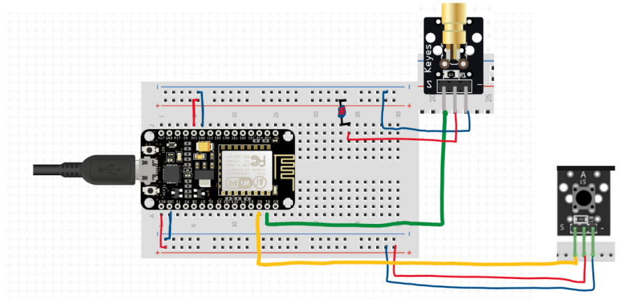
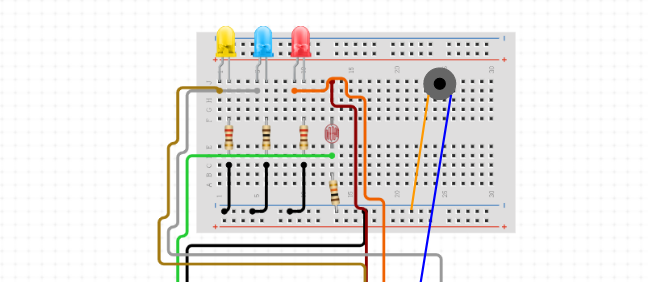

# Laser Tag 
CS179J - Senior Design Project   
Created by **Team n = 4**: Linda Ly, Justin Figueroa, Charles Alaras, Steven Hoang

## What is the project?
Our project is to create a laser tag game for 2 players, complete with laser blasters using laser pointers and wearable vests to detect hits. A blaster has an LED display that shows the player’s ammo count. When the blaster shoots, a visible laser is seen. To activate the blaster, a player must press a button on the blaster and it will only last a few milliseconds despite how long the player presses on the button. There is also be an option to reload the blaster’s ammo via another button.  

The vest has a photosensor on it to detect the laser from the blaster. LEDs are also attached to the vest. If the blue one is on, it means the player wearing it is available to be hit. If the red one is on, it means the player is dead or respawning and isn’t available to be hit. Another LED is near the photosensor to show the other player where to aim when shooting. When a player is hit, a speaker on the vest makes a noise to signify this.   

The entirety of the project is connected using Wi-Fi and interacts with a central application on a PC that tracks statistics. We will be sure to include proper PPE to ensure the safety of the participants and the students in the classroom when we demo.

## Benefits and Usefulness
The main benefit of our project is entertainment. This project can be used by 2 people. We also provide some features that are not included in a traditional laser tag game. These features include ammo reload using a button on the blaster and a display on the blaster  that shows the players’ current ammo. With these non-traditional features, our project makes the game of laser tag more interactive than it usually is. Our project improves the game in ways we think a lot of people want when playing laser tag.  

This project is useful as it provides a convenient way of playing laser tag. Instead of having to go to a place that’s specific for playing laser tag, this allows people to play laser tag in a place that’s most convenient to them. For example, they can play in their own home. Some laser tag places also require people to make reservations in advance when they want to play. This may cause some inconvenience to those who wish to play the game. Our project takes away all of those inconveniences so people can play laser tag whenever they want. 

## Design Outline
### Blaster Schematic Diagram
  
These components (including the wringing) are attached to the blaster made of pvc pipe.

### Vest Schematic Diagram
  
These components (including the wringing) are attached to the same NodeMCU in the blaster schematic diagram to create one set of laser tag equipment for one player. 

## Evaluation Metric
According to our project description above, it can be visually evident how well our project works. The lasers are able to be seen. In addition, LEDs and noises from speakers also provide evidence whether hits are successful or not. In fact, most of our project success is evident in this way.  

However, we would like to provide a more concrete way of evaluating our project. Since we have game statistics being displayed on a PC, the metric of evaluation is also based on how well it correctly displays what is currently going on in the game. For example, if one player successfully hits another player’s vest, it should correctly display on the PC. If not, no change should occur in regards to the display.

## Implementation Roadmap
| Week         | What We Already Implemented/Plan To Implement   | 
|--------------|-------------------------------------------------|
| 1            | Form our team; Brainstorm project ideas and backup ideas |                           
| 2            | Meet with professor to discuss project idea  | 
| 3            | Discuss details of the project: hardware and supplies we need, features we want to include, how we want to implement certain features; Buy supplies at Home Depot |
| 4            | Work on the laser blaster portion of the project (make a functioning prototype)| 
| 5            | Make the project design document; Work with accelerometer and ESP8266 (wi-fi  microchip); Set up backend of project; Make GitHub repo | 
| 6            | Work on vests (make a functioning prototype) | 
| 7            | Work on communication between blasters and vests | 
| 8            | Work on display of game statistics on a PC | 
| 9            | Debugging; Work on anything we might have fell behind on | 
| 10           | Debugging and final touches; Final presentation and In-Person Demo | 

## Additional Links
### Final Project Presentation
https://docs.google.com/presentation/d/1vK2SCP340fSqIO7Y1aTpx_e-loKFyNnFnSbsBWNQeLI/edit#slide=id.g108075af6293bdab_10

